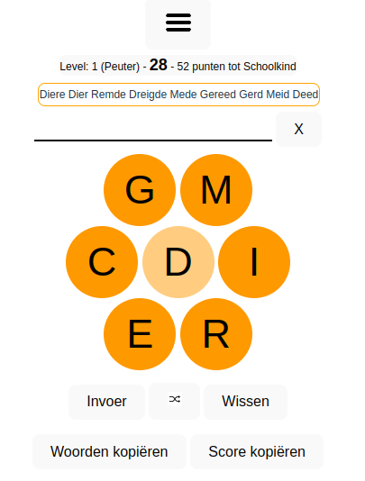

# Woordify



This is a word finding game, heavily inspired by [Wortify](https://6mal5.com/wortify/), which in turn is inspired by [Spelling Bee](https://www.nytimes.com/puzzles/spelling-bee). I didn't find a dutch version, so I had to create my own. You can try a working example [here](https://woordify.rgw.ch).

This version can easily be adapted to other languages - or other vocabularies (why not create a game to find medical terms, and so on). You'll only need to create a new server/words.txt, and probably translate the UI.

The program consists of a Server and a Client
<div style="clear:both"></div>

## Server

A simple REST interface (see [openapi.yml](server/openapi.yml))

The file [words.txt](server/words.txt) contains all about 148'000 words the game can use. You can replace the list by any other sufficiently large list. The words may contain no more than 7 different letters in any combination and must be at least 4 characters long. 

On current day's first call to /woorden, a file YYYY-MM-DD.txt is generated by executing creator#createNew(). The function reads [sevenchars.txt](server/sevenchars.txt), a subset of words.txt with words with exactly 7 different letters. If no such file exists, it will be created on the fly from words.txt

Then, one line from sevenchars.txt is selected randomly, and the characters of this word constitute the new game. One is selected randomly as the central letter. Then, words.txt is scanned for all words that contain the central letter and only any of the other characters. These words go in the file YYYY-MM-DD.txt for the current day and sent to the client.

### Create new contents

if 'sevenchars.txt' does not exist, a new one is created from 'words.txt'. If no 'words.txt' is found, a new one is created from 'words_raw.txt'.
if 'words_raw.txt' is not found. the scraper is launched to parse configured websites. This must be implemented individually. We include only
a not working example here. Any implementation will do, provided it creates a file named 'words_raw.txt' with a sufficiently large list of words, separated by \n.  

## Client

The client mimics the design of Spelling Bee and Wortify with some slight changes. It is optimized for mobile devices.

On startup, it loads the current day's word list from the server and checks the user's entries against this list. This concept was chosen (as in opposite do send each user entry to the server to have it checked there), to minimize server load and to allow continuing the game if network connection deteriorates.
The drawback is, that the solutions are on the client from the beginning, wich makes "cheating" possible, e.g. by manually calling `/woorden`. The word list is sent obfuscated to make this not too easy. That's no strong encryption, but, hey, it's only a game.

Game score is stored in the Browser's LocalStorage, if the user agree to do so. If they do, it's possible to continue an interrupted game, to review solutions later, and to show some stats.

## Development mode

````bash
git clone https://github.com/woordify
cd woordify/server
npm i
cd ../client
npm i
````

launch `npm run dev` in a terminal in ./server, and in another terminal in ./client. Then, navigate your browser to http://localhost:5173

## Build for production

````bash
cd client
npm run build
cd ../server
npm run build
node dist/index.js
````
Then, navigate to http://localhost:3333


## Apache integration

Recommended: use [Passenger](https://www.phusionpassenger.com/docs/advanced_guides/install_and_upgrade/apache/install/) and add the following to the apache configuration:

````
VirtualHost *:80>
        ServerName woordify.my.server.com
        DocumentRoot /some/where/woordify/app/server/public
        PassengerAppRoot /some/where/woordify/app/server

        PassengerAppType node
        PassengerStartupFile dist/index.js

        <Directory /some/where/woordify/app/server/public>
                Allow from all
                Options -MultiViews
        </Directory>

</VirtualHost>
````

